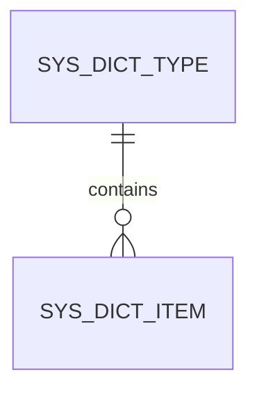

# 系统字典管理表设计文档

## 1. 表结构设计

### 1.1 字典类型表 (`sys_dict_type`)

| 字段名 | 数据类型 | 长度 | 主键 | 非空 | 默认值 | 描述 |
|-------|---------|------|------|------|--------|------|
| `id` | `BIGINT` | 20 | √ | √ | `NULL` | 字典类型ID |
| `dict_code` | `VARCHAR` | 50 | × | √ | `NULL` | 字典编码 |
| `dict_name` | `VARCHAR` | 100 | × | √ | `NULL` | 字典名称 |
| `status` | `TINYINT` | 1 | × | √ | `1` | 状态（1:启用，0:禁用） |
| `sort` | `INT` | 10 | × | × | `0` | 排序 |
| `remark` | `VARCHAR` | 255 | × | × | `NULL` | 备注 |
| `create_by` | `VARCHAR` | 50 | × | × | `NULL` | 创建人 |
| `create_time` | `DATETIME` | - | × | √ | `CURRENT_TIMESTAMP` | 创建时间 |
| `update_by` | `VARCHAR` | 50 | × | × | `NULL` | 更新人 |
| `update_time` | `DATETIME` | - | × | × | `NULL` | 更新时间 |

### 1.2 字典项表 (`sys_dict_item`)

| 字段名 | 数据类型 | 长度 | 主键 | 非空 | 默认值 | 描述 |
|-------|---------|------|------|------|--------|------|
| `id` | `BIGINT` | 20 | √ | √ | `NULL` | 字典项ID |
| `dict_type_id` | `BIGINT` | 20 | × | √ | `NULL` | 字典类型ID |
| `item_value` | `VARCHAR` | 50 | × | √ | `NULL` | 字典项值 |
| `item_name` | `VARCHAR` | 100 | × | √ | `NULL` | 字典项名称 |
| `sort` | `INT` | 10 | × | × | `0` | 排序 |
| `remark` | `VARCHAR` | 255 | × | × | `NULL` | 备注 |
| `create_by` | `VARCHAR` | 50 | × | × | `NULL` | 创建人 |
| `create_time` | `DATETIME` | - | × | √ | `CURRENT_TIMESTAMP` | 创建时间 |
| `update_by` | `VARCHAR` | 50 | × | × | `NULL` | 更新人 |
| `update_time` | `DATETIME` | - | × | × | `NULL` | 更新时间 |

## 2. 索引设计

### 2.1 字典类型表 (`sys_dict_type`)
- **唯一索引**：`uk_dict_code` 对 `dict_code` 字段，确保字典编码唯一
- **普通索引**：`idx_status` 对 `status` 字段，优化状态查询

### 2.2 字典项表 (`sys_dict_item`)
- **普通索引**：`idx_dict_type_id` 对 `dict_type_id` 字段，优化根据字典类型查询字典项
- **普通索引**：`idx_item_value` 对 `item_value` 字段，优化根据字典项值查询

## 3. 表关系



- 一个字典类型可以包含多个字典项
- 一个字典项只能属于一个字典类型

## 4. 数据示例

### 4.1 字典类型示例

| id | dict_code | dict_name | status | sort | remark |
|----|-----------|-----------|--------|------|--------|
| 1 | `order_status` | 订单状态 | 1 | 1 | 订单状态字典 |
| 2 | `logistics_status` | 物流状态 | 1 | 2 | 物流状态字典 |
| 3 | `product_status` | 商品状态 | 1 | 3 | 商品状态字典 |

### 4.2 字典项示例

| id | dict_type_id | item_value | item_name | sort | remark |
|----|--------------|------------|-----------|------|--------|
| 1 | 1 | `PENDING` | 待处理 | 1 | 订单待处理 |
| 2 | 1 | `PROCESSING` | 处理中 | 2 | 订单处理中 |
| 3 | 1 | `COMPLETED` | 已完成 | 3 | 订单已完成 |
| 4 | 1 | `CANCELLED` | 已取消 | 4 | 订单已取消 |
| 5 | 2 | `PENDING` | 待发货 | 1 | 物流待发货 |
| 6 | 2 | `SHIPPED` | 已发货 | 2 | 物流已发货 |
| 7 | 2 | `DELIVERED` | 已送达 | 3 | 物流已送达 |
| 8 | 3 | `NORMAL` | 正常 | 1 | 商品正常 |
| 9 | 3 | `DISCONTINUED` | 停产 | 2 | 商品停产 |
| 10 | 3 | `OUT_OF_STOCK` | 缺货 | 3 | 商品缺货 |

## 5. 建表SQL

```sql
-- 创建字典类型表
CREATE TABLE `sys_dict_type` (
  `id` BIGINT(20) NOT NULL AUTO_INCREMENT COMMENT '字典类型ID',
  `dict_code` VARCHAR(50) NOT NULL COMMENT '字典编码',
  `dict_name` VARCHAR(100) NOT NULL COMMENT '字典名称',
  `status` TINYINT(1) NOT NULL DEFAULT '1' COMMENT '状态（1:启用，0:禁用）',
  `sort` INT(10) DEFAULT '0' COMMENT '排序',
  `remark` VARCHAR(255) DEFAULT NULL COMMENT '备注',
  `create_by` VARCHAR(50) DEFAULT NULL COMMENT '创建人',
  `create_time` DATETIME NOT NULL DEFAULT CURRENT_TIMESTAMP COMMENT '创建时间',
  `update_by` VARCHAR(50) DEFAULT NULL COMMENT '更新人',
  `update_time` DATETIME DEFAULT NULL COMMENT '更新时间',
  PRIMARY KEY (`id`),
  UNIQUE KEY `uk_dict_code` (`dict_code`),
  KEY `idx_status` (`status`)
) ENGINE=InnoDB AUTO_INCREMENT=1 DEFAULT CHARSET=utf8mb4 COMMENT='字典类型表';

-- 创建字典项表
CREATE TABLE `sys_dict_item` (
  `id` BIGINT(20) NOT NULL AUTO_INCREMENT COMMENT '字典项ID',
  `dict_type_id` BIGINT(20) NOT NULL COMMENT '字典类型ID',
  `item_value` VARCHAR(50) NOT NULL COMMENT '字典项值',
  `item_name` VARCHAR(100) NOT NULL COMMENT '字典项名称',
  `sort` INT(10) DEFAULT '0' COMMENT '排序',
  `remark` VARCHAR(255) DEFAULT NULL COMMENT '备注',
  `create_by` VARCHAR(50) DEFAULT NULL COMMENT '创建人',
  `create_time` DATETIME NOT NULL DEFAULT CURRENT_TIMESTAMP COMMENT '创建时间',
  `update_by` VARCHAR(50) DEFAULT NULL COMMENT '更新人',
  `update_time` DATETIME DEFAULT NULL COMMENT '更新时间',
  PRIMARY KEY (`id`),
  KEY `idx_dict_type_id` (`dict_type_id`),
  KEY `idx_item_value` (`item_value`),
  CONSTRAINT `fk_dict_item_type` FOREIGN KEY (`dict_type_id`) REFERENCES `sys_dict_type` (`id`) ON DELETE CASCADE ON UPDATE CASCADE
) ENGINE=InnoDB AUTO_INCREMENT=1 DEFAULT CHARSET=utf8mb4 COMMENT='字典项表';

-- 插入示例数据
-- 字典类型
INSERT INTO `sys_dict_type` (`dict_code`, `dict_name`, `status`, `sort`, `remark`) VALUES
('order_status', '订单状态', 1, 1, '订单状态字典'),
('logistics_status', '物流状态', 1, 2, '物流状态字典'),
('product_status', '商品状态', 1, 3, '商品状态字典');

-- 字典项
INSERT INTO `sys_dict_item` (`dict_type_id`, `item_value`, `item_name`, `sort`, `remark`) VALUES
(1, 'PENDING', '待处理', 1, '订单待处理'),
(1, 'PROCESSING', '处理中', 2, '订单处理中'),
(1, 'COMPLETED', '已完成', 3, '订单已完成'),
(1, 'CANCELLED', '已取消', 4, '订单已取消'),
(2, 'PENDING', '待发货', 1, '物流待发货'),
(2, 'SHIPPED', '已发货', 2, '物流已发货'),
(2, 'DELIVERED', '已送达', 3, '物流已送达'),
(3, 'NORMAL', '正常', 1, '商品正常'),
(3, 'DISCONTINUED', '停产', 2, '商品停产'),
(3, 'OUT_OF_STOCK', '缺货', 3, '商品缺货');
```

## 6. 注意事项

1. **数据完整性**：通过外键约束确保字典项与字典类型的关联关系
2. **性能优化**：为常用查询字段添加索引，提高查询效率
3. **数据一致性**：使用事务确保字典数据的一致性
4. **安全性**：对字典数据的操作需要进行权限控制
5. **可维护性**：定期备份字典数据，确保数据安全

## 7. 总结

系统字典管理表设计采用了清晰的分层结构，通过字典类型和字典项的分离，实现了系统数据的统一管理和维护。这种设计不仅提高了系统的灵活性和可扩展性，还便于后续的功能扩展和数据维护。

通过本设计，系统可以实现对各种业务场景中需要用到的字典数据进行统一管理，如订单状态、物流状态、商品状态等，为系统的其他模块提供了标准化的数据参考。