# 进销存管理系统功能文档

## 1. 系统概述

### 1.1 系统简介
进销存管理系统是一款为企业提供采购、销售、库存管理等核心业务流程的综合性管理信息系统。系统采用 SpringBoot3 + JDK21 技术栈，支持条码/二维码扫描、第三方物流系统集成、多语言支持和AI对话功能，旨在帮助企业实现管理的自动化和信息化，提高运营效率，降低运营成本。

### 1.2 系统目标
- 实现采购、销售、库存等核心业务流程的自动化管理
- 提供实时的业务数据查询和分析功能，为企业决策提供支持
- 建立完善的用户权限管理体系，保障系统数据安全
- 优化业务流程，提高工作效率，降低企业运营成本
- 提供友好、易用的操作界面，降低用户学习成本
- 系统具备良好的扩展性和可维护性，以适应企业业务发展的需求

### 1.3 系统范围
本系统主要涵盖企业进销存管理的核心业务流程，包括采购管理、销售管理、库存管理、财务管理、基础数据管理、用户权限管理等功能模块。系统将实现这些模块之间的数据共享和业务协同，形成一个完整的企业管理信息系统。

## 2. 技术架构

### 2.1 技术栈
- **后端**：SpringBoot 3 + JDK 21
- **前端**：Vue 3 + Element Plus
- **数据库**：MySQL 8.0+
- **缓存**：Redis
- **消息队列**：RabbitMQ
- **认证**：JWT
- **API 文档**：SpringDoc OpenAPI
- **部署**：Docker + Kubernetes

### 2.2 系统架构
系统采用分层架构设计，主要包括以下层次：

1. **前端层**：Vue 3 + Element Plus 构建的单页应用
2. **API 网关层**：统一处理请求路由、负载均衡、权限校验
3. **服务层**：业务逻辑处理层，包含各个功能模块
4. **数据访问层**：与数据库交互的持久层
5. **数据存储层**：MySQL 数据库存储业务数据
6. **缓存层**：Redis 缓存热点数据
7. **消息层**：RabbitMQ 处理异步消息

### 2.3 模块划分

| 模块名称 | 主要职责 | 技术实现 |
|---------|---------|----------|
| 基础数据模块 | 管理商品、供应商、客户、仓库、系统字典等基础数据 | Spring Boot + MyBatis-Plus |
| 采购管理模块 | 处理采购申请、订单、入库、付款等业务 | Spring Boot + MyBatis-Plus |
| 库存管理模块 | 管理库存变动、调拨、盘点、预警等 | Spring Boot + MyBatis-Plus |
| 销售管理模块 | 处理销售订单、出库、收款等业务 | Spring Boot + MyBatis-Plus |
| 财务管理模块 | 管理应收账款、应付账款、费用等 | Spring Boot + MyBatis-Plus |
| 报表分析模块 | 生成各类业务报表和数据分析 | Spring Boot + ECharts |
| 用户权限模块 | 管理用户、角色、权限等 | Spring Boot + Spring Security |
| 条码/二维码模块 | 生成和扫描条码/二维码 | Spring Boot + ZXing |
| 物流集成模块 | 集成第三方物流系统 | Spring Boot + RESTful API |
| 多语言模块 | 支持多语言界面 | Spring Boot + i18n |
| AI对话模块 | 提供AI助手功能 | Spring Boot + OpenAI API |

## 3. 功能模块详细设计

### 3.1 基础数据模块

#### 3.1.1 商品信息管理
- **功能描述**：维护商品基础资料，包括商品名称、规格、型号、分类、单位、成本价、销售价等
- **实现方式**：
  - 前端：商品信息表单、列表展示、搜索筛选
  - 后端：RESTful API，CRUD 操作，数据验证
  - 数据库：`product` 表存储商品信息

#### 3.1.2 供应商管理
- **功能描述**：管理供应商信息，包括供应商名称、联系人、电话、地址、银行账户等
- **实现方式**：
  - 前端：供应商信息表单、列表展示、搜索筛选
  - 后端：RESTful API，CRUD 操作，数据验证
  - 数据库：`supplier` 表存储供应商信息

#### 3.1.3 客户管理
- **功能描述**：管理客户信息，包括客户名称、联系人、电话、地址、信用额度等
- **实现方式**：
  - 前端：客户信息表单、列表展示、搜索筛选
  - 后端：RESTful API，CRUD 操作，数据验证
  - 数据库：`customer` 表存储客户信息

#### 3.1.4 仓库管理
- **功能描述**：管理仓库信息，包括仓库名称、地址、负责人等
- **实现方式**：
  - 前端：仓库信息表单、列表展示、搜索筛选
  - 后端：RESTful API，CRUD 操作，数据验证
  - 数据库：`warehouse` 表存储仓库信息

#### 3.1.5 计量单位管理
- **功能描述**：维护系统使用的各种计量单位
- **实现方式**：
  - 前端：计量单位表单、列表展示、搜索筛选
  - 后端：RESTful API，CRUD 操作，数据验证
  - 数据库：`unit` 表存储计量单位信息

#### 3.1.6 商品分类管理
- **功能描述**：对商品进行分类维护
- **实现方式**：
  - 前端：商品分类表单、树状展示、搜索筛选
  - 后端：RESTful API，CRUD 操作，数据验证
  - 数据库：`product_category` 表存储商品分类信息

#### 3.1.7 系统字典管理
- **功能描述**：维护系统中使用的各种字典数据，包括字典类型和字典项，为系统提供统一的数据参考
- **实现方式**：
  - 前端：字典类型表单、字典项管理、列表展示、搜索筛选
  - 后端：RESTful API，CRUD 操作，数据验证
  - 数据库：`sys_dict_type` 表存储字典类型信息，`sys_dict_item` 表存储字典项信息

### 3.2 采购管理模块

#### 3.2.1 采购申请管理
- **功能描述**：处理采购申请的创建、审批、查询等
- **实现方式**：
  - 前端：采购申请表单、列表展示、审批流程
  - 后端：RESTful API，工作流审批，状态管理
  - 数据库：`purchase_application` 表存储采购申请信息

#### 3.2.2 采购订单管理
- **功能描述**：管理采购订单的创建、审核、下发、跟踪等
- **实现方式**：
  - 前端：采购订单表单、列表展示、审核流程
  - 后端：RESTful API，订单状态管理，物流集成
  - 数据库：`purchase_order` 和 `purchase_order_detail` 表存储订单信息

#### 3.2.3 采购入库管理
- **功能描述**：处理采购入库业务，包括入库单的创建、审核、入库确认等
- **实现方式**：
  - 前端：采购入库单表单、列表展示、审核流程
  - 后端：RESTful API，库存更新，条码/二维码扫描
  - 数据库：`purchase_receipt` 和 `purchase_receipt_detail` 表存储入库信息

#### 3.2.4 采购付款管理
- **功能描述**：处理采购付款业务，包括付款申请、审批、付款执行等
- **实现方式**：
  - 前端：付款申请表单、列表展示、审批流程
  - 后端：RESTful API，付款状态管理，财务集成
  - 数据库：`payment_record` 表存储付款信息

### 3.3 库存管理模块

#### 3.3.1 入库管理
- **功能描述**：处理各种入库业务，包括采购入库、销售退货入库、调拨入库、盘盈入库等
- **实现方式**：
  - 前端：入库单表单、列表展示、条码/二维码扫描
  - 后端：RESTful API，库存更新，事务处理
  - 数据库：`inventory` 和 `inventory_history` 表存储库存信息

#### 3.3.2 出库管理
- **功能描述**：处理各种出库业务，包括销售出库、采购退货出库、调拨出库、盘亏出库等
- **实现方式**：
  - 前端：出库单表单、列表展示、条码/二维码扫描
  - 后端：RESTful API，库存更新，库存校验
  - 数据库：`inventory` 和 `inventory_history` 表存储库存信息

#### 3.3.3 库存调拨
- **功能描述**：处理仓库之间的商品调拨业务
- **实现方式**：
  - 前端：调拨单表单、列表展示、审批流程
  - 后端：RESTful API，库存更新，事务处理
  - 数据库：`inventory_transfer` 和 `inventory_transfer_detail` 表存储调拨信息

#### 3.3.4 库存盘点
- **功能描述**：对库存进行定期或不定期盘点，处理盘盈盘亏
- **实现方式**：
  - 前端：盘点单表单、列表展示、条码/二维码扫描
  - 后端：RESTful API，库存调整，差异处理
  - 数据库：`inventory_check` 和 `inventory_check_detail` 表存储盘点信息

#### 3.3.5 库存预警
- **功能描述**：设置库存上下限，对库存异常情况进行预警
- **实现方式**：
  - 前端：库存预警设置、预警信息展示
  - 后端：定时任务，库存检查，预警通知
  - 数据库：`inventory` 表存储库存信息，`alert` 表存储预警信息

### 3.4 销售管理模块

#### 3.4.1 销售订单管理
- **功能描述**：管理销售订单的创建、审核、下发、跟踪等
- **实现方式**：
  - 前端：销售订单表单、列表展示、审核流程
  - 后端：RESTful API，订单状态管理，物流集成
  - 数据库：`sales_order` 和 `sales_order_detail` 表存储订单信息

#### 3.4.2 销售出库管理
- **功能描述**：处理销售出库业务，包括出库单的创建、审核、出库确认等
- **实现方式**：
  - 前端：销售出库单表单、列表展示、条码/二维码扫描
  - 后端：RESTful API，库存更新，物流集成
  - 数据库：`sales_shipment` 和 `sales_shipment_detail` 表存储出库信息

#### 3.4.3 销售收款管理
- **功能描述**：处理销售收款业务，包括收款申请、审批、收款执行等
- **实现方式**：
  - 前端：收款申请表单、列表展示、审批流程
  - 后端：RESTful API，收款状态管理，财务集成
  - 数据库：`payment_record` 表存储收款信息

### 3.5 财务管理模块

#### 3.5.1 应收账款管理
- **功能描述**：管理客户应收账款，包括应收账款的记录、核销、账龄分析等
- **实现方式**：
  - 前端：应收账款列表、核销操作、账龄分析报表
  - 后端：RESTful API，应收账款管理，账龄计算
  - 数据库：`accounts_receivable` 表存储应收账款信息

#### 3.5.2 应付账款管理
- **功能描述**：管理供应商应付账款，包括应付账款的记录、核销、账龄分析等
- **实现方式**：
  - 前端：应付账款列表、核销操作、账龄分析报表
  - 后端：RESTful API，应付账款管理，账龄计算
  - 数据库：`accounts_payable` 表存储应付账款信息

#### 3.5.3 费用管理
- **功能描述**：管理企业各项费用，包括费用的申请、审批、报销等
- **实现方式**：
  - 前端：费用申请表单、列表展示、审批流程
  - 后端：RESTful API，费用管理，审批流程
  - 数据库：`expense` 表存储费用信息

### 3.6 报表分析模块

#### 3.6.1 采购报表
- **功能描述**：生成各种采购报表，如采购汇总表、采购明细表、采购趋势分析表等
- **实现方式**：
  - 前端：报表筛选、图表展示、导出功能
  - 后端：RESTful API，数据聚合，报表生成
  - 数据库：查询采购相关表数据

#### 3.6.2 销售报表
- **功能描述**：生成各种销售报表，如销售汇总表、销售明细表、销售趋势分析表等
- **实现方式**：
  - 前端：报表筛选、图表展示、导出功能
  - 后端：RESTful API，数据聚合，报表生成
  - 数据库：查询销售相关表数据

#### 3.6.3 库存报表
- **功能描述**：生成各种库存报表，如库存汇总表、库存明细表、库存周转率报表等
- **实现方式**：
  - 前端：报表筛选、图表展示、导出功能
  - 后端：RESTful API，数据聚合，报表生成
  - 数据库：查询库存相关表数据

#### 3.6.4 财务报表
- **功能描述**：生成各种财务报表，如资产负债表、利润表、现金流量表等
- **实现方式**：
  - 前端：报表筛选、图表展示、导出功能
  - 后端：RESTful API，数据聚合，报表生成
  - 数据库：查询财务相关表数据

### 3.7 用户权限模块

#### 3.7.1 用户管理
- **功能描述**：管理系统用户，包括用户的创建、修改、删除、启用禁用等
- **实现方式**：
  - 前端：用户表单、列表展示、搜索筛选
  - 后端：RESTful API，用户管理，密码加密
  - 数据库：`t_user` 表存储用户信息

#### 3.7.2 角色管理
- **功能描述**：管理系统角色，包括角色的创建、修改、删除等
- **实现方式**：
  - 前端：角色表单、列表展示、权限分配
  - 后端：RESTful API，角色管理
  - 数据库：`t_role` 表存储角色信息

#### 3.7.3 权限管理
- **功能描述**：管理系统权限，包括菜单权限、按钮权限、数据权限等
- **实现方式**：
  - 前端：权限配置界面、权限树展示
  - 后端：RESTful API，权限管理，权限校验
  - 数据库：`permission` 表存储权限信息

### 3.8 条码/二维码模块

#### 3.8.1 条码/二维码生成
- **功能描述**：生成商品的条码/二维码
- **实现方式**：
  - 前端：条码/二维码生成界面、预览功能
  - 后端：RESTful API，条码/二维码生成，图片处理
  - 数据库：`product` 表存储条码/二维码信息

#### 3.8.2 条码/二维码扫描
- **功能描述**：通过扫描条码/二维码进行快速操作
- **实现方式**：
  - 前端：扫描界面、摄像头调用
  - 后端：RESTful API，条码/二维码解析，业务处理
  - 数据库：查询相关业务表数据

#### 3.8.3 条码/二维码管理
- **功能描述**：管理商品的条码/二维码
- **实现方式**：
  - 前端：条码/二维码列表、搜索筛选
  - 后端：RESTful API，条码/二维码管理
  - 数据库：`product` 表存储条码/二维码信息

### 3.9 物流集成模块

#### 3.9.1 第三方物流系统集成
- **功能描述**：集成第三方物流系统，实现物流信息的交互
- **实现方式**：
  - 前端：物流系统配置界面
  - 后端：RESTful API，第三方 API 调用，数据同步
  - 数据库：`logistics` 表存储物流信息

#### 3.9.2 物流单号生成
- **功能描述**：生成物流单号
- **实现方式**：
  - 前端：物流单号生成界面
  - 后端：RESTful API，单号生成，第三方 API 调用
  - 数据库：`logistics` 表存储物流单号信息

#### 3.9.3 物流状态跟踪
- **功能描述**：跟踪物流状态
- **实现方式**：
  - 前端：物流状态查询界面、状态展示
  - 后端：RESTful API，第三方 API 调用，状态更新
  - 数据库：`logistics` 表存储物流状态信息

### 3.10 多语言模块

#### 3.10.1 语言设置
- **功能描述**：设置系统支持的语言
- **实现方式**：
  - 前端：语言设置界面
  - 后端：RESTful API，语言配置管理
  - 数据库：`language` 表存储语言配置

#### 3.10.2 多语言支持
- **功能描述**：支持多语言界面
- **实现方式**：
  - 前端：多语言资源文件，语言切换组件
  - 后端：i18n 支持，语言资源管理
  - 数据库：`language_resource` 表存储语言资源

#### 3.10.3 语言切换
- **功能描述**：用户可以根据需要切换语言
- **实现方式**：
  - 前端：语言切换下拉菜单，实时语言切换
  - 后端：RESTful API，用户语言偏好设置
  - 数据库：`t_user` 表存储用户语言偏好

### 3.11 AI对话模块

#### 3.11.1 AI助手
- **功能描述**：提供AI对话功能，用户可以通过与AI助手对话获取系统操作指导、业务咨询和数据分析等服务
- **实现方式**：
  - 前端：对话界面、消息输入、历史记录
  - 后端：RESTful API，AI模型调用，业务逻辑处理
  - 数据库：`ai_conversation` 和 `ai_message` 表存储对话历史

#### 3.11.2 业务咨询
- **功能描述**：提供业务相关的咨询服务
- **实现方式**：
  - 前端：对话界面，业务问题输入
  - 后端：RESTful API，AI模型调用，业务数据查询
  - 数据库：查询相关业务表数据

#### 3.11.3 操作指导
- **功能描述**：提供系统操作步骤的指导
- **实现方式**：
  - 前端：对话界面，操作问题输入
  - 后端：RESTful API，AI模型调用，操作指南生成
  - 数据库：查询系统操作相关数据

#### 3.11.4 数据分析
- **功能描述**：提供业务数据分析服务
- **实现方式**：
  - 前端：对话界面，数据分析请求
  - 后端：RESTful API，AI模型调用，数据聚合分析
  - 数据库：查询相关业务表数据，生成分析结果

## 4. 数据库设计

### 4.1 数据库表结构

#### 4.1.1 基础数据模块
- **商品表** (`product`)：存储商品基本信息
- **供应商表** (`supplier`)：存储供应商信息
- **客户表** (`customer`)：存储客户信息
- **仓库表** (`warehouse`)：存储仓库信息
- **计量单位表** (`unit`)：存储计量单位信息
- **商品分类表** (`product_category`)：存储商品分类信息
- **字典类型表** (`sys_dict_type`)：存储字典类型信息
- **字典项表** (`sys_dict_item`)：存储字典项信息

#### 4.1.2 采购管理模块
- **采购申请表** (`purchase_application`)：存储采购申请信息
- **采购订单表** (`purchase_order`)：存储采购订单信息
- **采购订单明细表** (`purchase_order_detail`)：存储采购订单明细信息
- **采购入库单表** (`purchase_receipt`)：存储采购入库单信息
- **采购入库单明细表** (`purchase_receipt_detail`)：存储采购入库单明细信息

#### 4.1.3 库存管理模块
- **库存表** (`inventory`)：存储商品库存信息
- **库存流水表** (`inventory_history`)：记录库存变动历史
- **库存盘点表** (`inventory_check`)：存储库存盘点信息
- **库存盘点明细表** (`inventory_check_detail`)：存储库存盘点明细信息
- **库存调拨单表** (`inventory_transfer`)：存储库存调拨单信息
- **库存调拨单明细表** (`inventory_transfer_detail`)：存储库存调拨单明细信息

#### 4.1.4 销售管理模块
- **销售订单表** (`sales_order`)：存储销售订单信息
- **销售订单明细表** (`sales_order_detail`)：存储销售订单明细信息
- **销售出库单表** (`sales_shipment`)：存储销售出库单信息
- **销售出库单明细表** (`sales_shipment_detail`)：存储销售出库单明细信息

#### 4.1.5 财务管理模块
- **应收账款表** (`accounts_receivable`)：存储应收账款信息
- **应付账款表** (`accounts_payable`)：存储应付账款信息
- **收付款记录表** (`payment_record`)：存储收付款记录信息
- **费用表** (`expense`)：存储费用信息

#### 4.1.6 用户权限模块
- **用户表** (`t_user`)：存储系统用户信息
- **角色表** (`t_role`)：存储系统角色信息
- **权限表** (`permission`)：存储系统权限信息
- **用户角色关联表** (`t_user_role`)：关联用户和角色
- **角色权限关联表** (`t_role_permission`)：关联角色和权限

#### 4.1.7 条码/二维码模块
- **条码/二维码表** (`barcode`)：存储条码/二维码信息

#### 4.1.8 物流集成模块
- **物流表** (`logistics`)：存储物流信息

#### 4.1.9 多语言模块
- **语言表** (`language`)：存储语言配置信息
- **语言资源表** (`language_resource`)：存储语言资源信息

#### 4.1.10 AI对话模块
- **对话表** (`ai_conversation`)：存储对话信息
- **消息表** (`ai_message`)：存储对话消息信息

### 4.2 数据库关系图

```mermaid
erDiagram
    PRODUCT ||--o{ PURCHASE_ORDER_DETAIL : contains
    PRODUCT ||--o{ SALES_ORDER_DETAIL : contains
    PRODUCT ||--o{ INVENTORY : has
    SUPPLIER ||--o{ PURCHASE_ORDER : places
    CUSTOMER ||--o{ SALES_ORDER : places
    WAREHOUSE ||--o{ INVENTORY : stores
    WAREHOUSE ||--o{ INVENTORY_TRANSFER : transfers
    PURCHASE_ORDER ||--o{ PURCHASE_ORDER_DETAIL : details
    PURCHASE_ORDER ||--o{ PURCHASE_RECEIPT : receives
    PURCHASE_RECEIPT ||--o{ PURCHASE_RECEIPT_DETAIL : details
    SALES_ORDER ||--o{ SALES_ORDER_DETAIL : details
    SALES_ORDER ||--o{ SALES_SHIPMENT : ships
    SALES_SHIPMENT ||--o{ SALES_SHIPMENT_DETAIL : details
    INVENTORY ||--o{ INVENTORY_HISTORY : records
    INVENTORY_CHECK ||--o{ INVENTORY_CHECK_DETAIL : details
    INVENTORY_TRANSFER ||--o{ INVENTORY_TRANSFER_DETAIL : details
    SALES_ORDER ||--o{ ACCOUNTS_RECEIVABLE : generates
    PURCHASE_ORDER ||--o{ ACCOUNTS_PAYABLE : generates
    ACCOUNTS_RECEIVABLE ||--o{ PAYMENT_RECORD : pays
    ACCOUNTS_PAYABLE ||--o{ PAYMENT_RECORD : pays
    T_USER ||--o{ T_USER_ROLE : assigned
    T_ROLE ||--o{ T_USER_ROLE : includes
    T_ROLE ||--o{ T_ROLE_PERMISSION : has
    PERMISSION ||--o{ T_ROLE_PERMISSION : includes
    PRODUCT ||--o{ BARCODE : has
    PURCHASE_ORDER ||--o{ LOGISTICS : tracks
    SALES_ORDER ||--o{ LOGISTICS : tracks
    T_USER ||--o{ AI_CONVERSATION : starts
    AI_CONVERSATION ||--o{ AI_MESSAGE : contains
    SYS_DICT_TYPE ||--o{ SYS_DICT_ITEM : contains
```

## 5. API 接口设计

### 5.1 接口设计原则
- **RESTful 风格**：使用 HTTP 方法（GET、POST、PUT、DELETE）表示操作类型
- **统一响应格式**：所有接口返回统一的 JSON 格式，包含 code、message、data 字段
- **版本控制**：API 路径包含版本号，如 `/api/v1/products`
- **权限控制**：接口需要进行身份认证和权限校验
- **参数验证**：请求参数需要进行验证，确保数据合法性

### 5.2 主要接口列表

#### 5.2.1 基础数据模块
- `GET /api/v1/products` - 获取商品列表
- `POST /api/v1/products` - 创建商品
- `GET /api/v1/products/{id}` - 获取商品详情
- `PUT /api/v1/products/{id}` - 更新商品
- `DELETE /api/v1/products/{id}` - 删除商品
- `GET /api/v1/suppliers` - 获取供应商列表
- `POST /api/v1/suppliers` - 创建供应商
- `GET /api/v1/customers` - 获取客户列表
- `POST /api/v1/customers` - 创建客户
- `GET /api/v1/warehouses` - 获取仓库列表
- `POST /api/v1/warehouses` - 创建仓库
- `GET /api/v1/dict/types` - 获取字典类型列表
- `POST /api/v1/dict/types` - 创建字典类型
- `GET /api/v1/dict/types/{id}` - 获取字典类型详情
- `PUT /api/v1/dict/types/{id}` - 更新字典类型
- `DELETE /api/v1/dict/types/{id}` - 删除字典类型
- `GET /api/v1/dict/items` - 获取字典项列表
- `POST /api/v1/dict/items` - 创建字典项
- `GET /api/v1/dict/items/{id}` - 获取字典项详情
- `PUT /api/v1/dict/items/{id}` - 更新字典项
- `DELETE /api/v1/dict/items/{id}` - 删除字典项
- `GET /api/v1/dict/items/by-type/{typeCode}` - 根据字典类型获取字典项

#### 5.2.2 采购管理模块
- `GET /api/v1/purchase/applications` - 获取采购申请列表
- `POST /api/v1/purchase/applications` - 创建采购申请
- `GET /api/v1/purchase/orders` - 获取采购订单列表
- `POST /api/v1/purchase/orders` - 创建采购订单
- `GET /api/v1/purchase/receipts` - 获取采购入库单列表
- `POST /api/v1/purchase/receipts` - 创建采购入库单

#### 5.2.3 库存管理模块
- `GET /api/v1/inventory` - 获取库存列表
- `POST /api/v1/inventory/transfer` - 创建库存调拨单
- `POST /api/v1/inventory/check` - 创建库存盘点单
- `GET /api/v1/inventory/alert` - 获取库存预警信息

#### 5.2.4 销售管理模块
- `GET /api/v1/sales/orders` - 获取销售订单列表
- `POST /api/v1/sales/orders` - 创建销售订单
- `GET /api/v1/sales/shipments` - 获取销售出库单列表
- `POST /api/v1/sales/shipments` - 创建销售出库单

#### 5.2.5 财务管理模块
- `GET /api/v1/finance/accounts-receivable` - 获取应收账款列表
- `GET /api/v1/finance/accounts-payable` - 获取应付账款列表
- `POST /api/v1/finance/payments` - 创建收付款记录

#### 5.2.6 报表分析模块
- `GET /api/v1/reports/purchase` - 获取采购报表
- `GET /api/v1/reports/sales` - 获取销售报表
- `GET /api/v1/reports/inventory` - 获取库存报表
- `GET /api/v1/reports/finance` - 获取财务报表

#### 5.2.7 用户权限模块
- `POST /api/v1/auth/login` - 用户登录
- `GET /api/v1/users` - 获取用户列表
- `POST /api/v1/users` - 创建用户
- `GET /api/v1/roles` - 获取角色列表
- `POST /api/v1/roles` - 创建角色
- `GET /api/v1/permissions` - 获取权限列表

#### 5.2.8 条码/二维码模块
- `POST /api/v1/barcode/generate` - 生成条码/二维码
- `POST /api/v1/barcode/scan` - 扫描条码/二维码

#### 5.2.9 物流集成模块
- `POST /api/v1/logistics/generate` - 生成物流单号
- `GET /api/v1/logistics/track/{id}` - 跟踪物流状态

#### 5.2.10 多语言模块
- `GET /api/v1/language` - 获取语言列表
- `POST /api/v1/language/switch` - 切换语言

#### 5.2.11 AI对话模块
- `POST /api/v1/ai/chat` - AI对话
- `GET /api/v1/ai/conversations` - 获取对话历史

## 6. 部署与集成方案

### 6.1 部署架构
- **开发环境**：本地开发，Docker 容器
- **测试环境**：Docker Compose 部署
- **生产环境**：Kubernetes 集群部署

### 6.2 集成方案
- **第三方物流系统**：通过 RESTful API 集成
- **支付系统**：通过 RESTful API 集成
- **AI 服务**：通过 OpenAI API 集成
- **报表导出**：支持 Excel、PDF 格式导出

### 6.3 数据迁移
- **初始数据**：系统初始化时导入基础数据
- **数据备份**：定期备份数据库
- **数据恢复**：支持从备份恢复数据

## 7. 性能与安全考虑

### 7.1 性能优化
- **数据库优化**：索引优化、查询优化、分库分表
- **缓存优化**：Redis 缓存热点数据
- **代码优化**：异步处理、批量操作、连接池优化
- **前端优化**：组件懒加载、资源压缩、CDN 加速

### 7.2 安全措施
- **身份认证**：JWT 令牌认证
- **权限控制**：基于角色的权限控制
- **数据加密**：敏感数据加密存储，HTTPS 传输
- **防 SQL 注入**：参数化查询
- **防 XSS 攻击**：输入验证和过滤
- **防 CSRF 攻击**：CSRF 令牌
- **日志审计**：操作日志记录

### 7.3 监控与告警
- **系统监控**：Prometheus + Grafana 监控系统指标
- **应用监控**：Spring Boot Actuator 监控应用状态
- **日志监控**：ELK 日志收集和分析
- **告警机制**：异常情况告警通知

## 8. 总结

进销存管理系统是一款功能完善、架构先进、安全可靠的企业管理信息系统。它采用 SpringBoot3 + JDK21 技术栈，涵盖了企业采购、销售、库存、财务等核心业务流程，提供了条码/二维码扫描、第三方物流系统集成、多语言支持和AI对话功能，能够帮助企业实现管理的自动化和信息化，提高运营效率，降低运营成本。

系统具有良好的扩展性和可维护性，能够适应企业业务的快速发展。同时，系统采用了多种安全措施，保障系统数据的安全性和可靠性。

通过本系统的实施，企业可以实现以下目标：
- 提高采购、销售、库存等业务流程的效率和准确性
- 实时掌握企业的业务数据和运营状况
- 优化库存管理，提高库存周转率，降低库存成本
- 加强财务管理，提高资金使用效率
- 为企业决策提供科学依据
- 提升企业的整体管理水平和竞争力

综上所述，进销存管理系统是一款适合中小型企业使用的综合性管理信息系统，具有广阔的应用前景和市场价值。