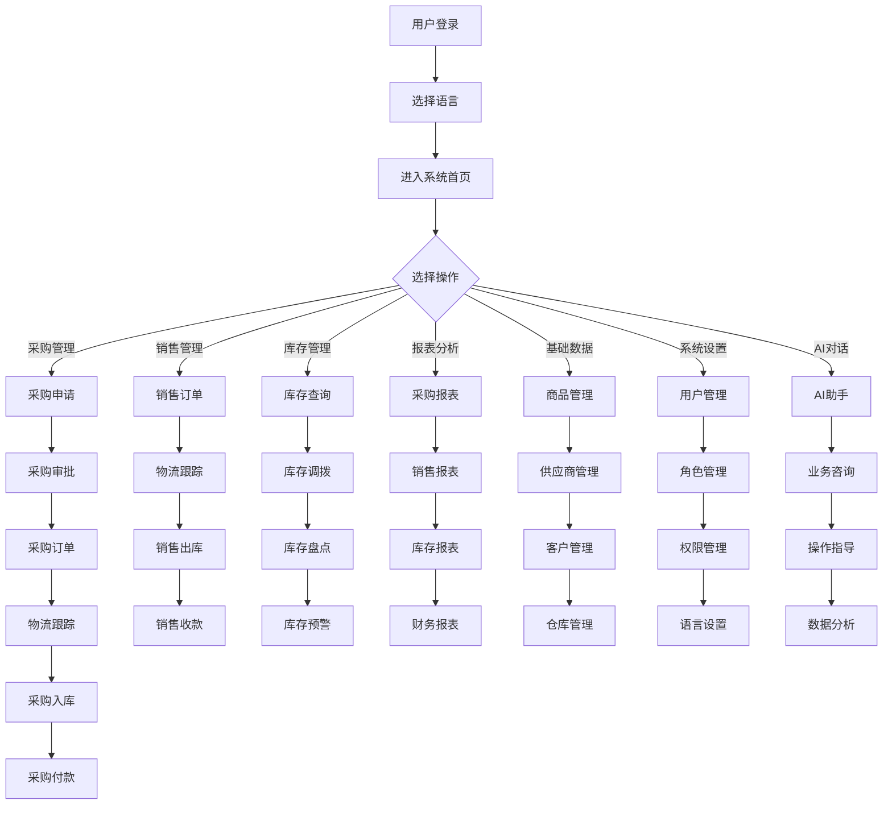

# 进销存管理系统 - 落地需求文档（最终版）

## 1. 产品概述
这是一个给企业管理人员和仓库管理员用的 Web 应用，帮他们登记货物的采购和使用情况，并对耗材进行分析。与现有方案相比，核心差异是提供了完整的采购、库存、销售流程管理和多维度的数据分析功能，同时支持条码/二维码扫描、第三方物流系统集成、多语言支持和AI对话功能。

## 2. 目标用户与使用场景

### 用户画像
1. **仓库管理员**：
   - 负责货物的入库、出库、库存管理等日常操作
   - 需要快速准确地记录货物变动
   - 关注库存预警和库存盘点
   - 使用条码/二维码扫描功能提高操作效率
   - 可能使用AI对话功能获取操作指导

2. **企业管理人员**：
   - 需要查看数据分析报表，进行决策
   - 关注采购成本、销售收益、库存周转率等指标
   - 需要审批采购申请和费用申请
   - 可能需要使用多语言界面
   - 可能使用AI对话功能获取数据分析和决策支持

3. **物流管理人员**：
   - 负责物流信息的跟踪和管理
   - 需要查看物流状态和配送情况
   - 与第三方物流系统进行交互

4. **系统用户**：
   - 所有系统用户都可以使用AI对话功能获取系统操作指导和业务咨询

### 典型使用场景
1. **采购流程**：
   - 仓库管理员发现库存不足，提交采购申请
   - 管理人员审批采购申请
   - 采购人员创建采购订单并发送给供应商
   - 供应商发货后，仓库管理员使用条码/二维码扫描进行采购入库
   - 系统自动集成第三方物流系统，跟踪物流状态
   - 财务人员处理采购付款

2. **销售流程**：
   - 销售人员创建销售订单
   - 仓库管理员使用条码/二维码扫描根据销售订单进行销售出库
   - 系统自动集成第三方物流系统，生成物流单号和跟踪信息
   - 财务人员开具销售发票并处理收款

3. **库存管理**：
   - 仓库管理员使用条码/二维码扫描进行库存盘点
   - 系统自动生成库存预警，提醒库存不足或过多
   - 仓库管理员在多个仓库之间进行库存调拨
   - 管理人员查看多语言界面的库存报表

4. **AI对话场景**：
   - 用户通过AI对话功能询问系统操作步骤
   - 用户通过AI对话功能获取业务数据分析
   - 用户通过AI对话功能获取采购、销售、库存等业务建议
   - 用户通过AI对话功能查询系统功能和使用方法

## 3. 核心用户动线



## 4. 功能清单

```
进销存管理系统
├── 🔴 基础数据模块（核心，MVP 必须有）
│   ├── 商品信息管理
│   ├── 供应商管理
│   ├── 客户管理
│   ├── 仓库管理
│   ├── 计量单位管理
│   ├── 商品分类管理
│   └── 系统字典管理
├── 🔴 采购管理模块（核心，MVP 必须有）
│   ├── 采购申请管理
│   ├── 采购订单管理
│   ├── 采购入库管理
│   └── 采购付款管理
├── 🔴 库存管理模块（核心，MVP 必须有）
│   ├── 入库管理
│   ├── 出库管理
│   ├── 库存调拨
│   ├── 库存盘点
│   └── 库存预警
├── 🔴 销售管理模块（核心，MVP 必须有）
│   ├── 销售订单管理
│   ├── 销售出库管理
│   └── 销售收款管理
├── 🟡 财务管理模块（重要，后续迭代）
│   ├── 应收账款管理
│   ├── 应付账款管理
│   └── 费用管理
├── 🟡 报表分析模块（重要，后续迭代）
│   ├── 采购报表
│   ├── 销售报表
│   ├── 库存报表
│   └── 财务报表
├── 🔴 用户权限模块（核心，MVP 必须有）
│   ├── 用户管理
│   ├── 角色管理
│   └── 权限管理
├── 🔴 条码/二维码模块（核心，MVP 必须有）
│   ├── 条码/二维码生成
│   ├── 条码/二维码扫描
│   └── 条码/二维码管理
├── 🔴 物流集成模块（核心，MVP 必须有）
│   ├── 第三方物流系统集成
│   ├── 物流单号生成
│   └── 物流状态跟踪
├── 🔴 多语言模块（核心，MVP 必须有）
│   ├── 语言设置
│   ├── 多语言支持
│   └── 语言切换
└── 🔴 AI对话模块（核心，MVP 必须有）
    ├── AI助手
    ├── 业务咨询
    ├── 操作指导
    └── 数据分析
```

### 4.1 关键页面布局线框图

**系统首页/主控制台**

```
┌──────────────────────────────────────────────────────┐
│  [Logo] 进销存管理系统        顶部全局导航栏（用户信息/通知/设置/语言/AI助手）│
├──────────┬───────────────────────────────────────────┤
│          │  面包屑导航 / 页面标题 + 操作按钮（新建等）  │
│  左侧    ├───────────────────────────────────────────┤
│  竖向    │                                           │
│  导航    │      主内容区（数据看板/待办事项）         │
│  菜单    │      ← 视觉重心，占据最大面积               │
│          │                                           │
│  [基础数据] ├───────────────────────────────────────────┤
│  [采购管理] │  底部分页 / 状态栏                         │
│  [库存管理] │                                           │
│  [销售管理] │                                           │
│  [财务管理] │                                           │
│  [报表分析] │                                           │
│  [系统设置] │                                           │
└──────────┴───────────────────────────────────────────┘
```

**AI对话界面**

```
┌──────────────────────────────────────────────────────┐
│  [Logo] 进销存管理系统        顶部全局导航栏（用户信息/通知/设置/语言）│
├──────────┬───────────────────────────────────────────┤
│          │  面包屑导航 / 页面标题：AI助手             │
│  左侧    ├───────────────────────────────────────────┤
│  竖向    │                                           │
│  导航    │      对话区域（AI回复和用户输入）          │
│  菜单    │      ← 视觉重心，占据最大面积               │
│          │                                           │
│  [基础数据] ├───────────────────────────────────────────┤
│  [采购管理] │  输入框 / 发送按钮                       │
│  [库存管理] │  快捷问题选项                            │
│  [销售管理] │                                           │
│  [财务管理] │                                           │
│  [报表分析] │                                           │
│  [系统设置] │                                           │
└──────────┴───────────────────────────────────────────┘
```

## 5. 功能详细描述

### 5.1 商品信息管理

**功能描述**：维护商品基础资料，包括商品名称、规格、型号、分类、单位、成本价、销售价等。

**触发条件**：用户点击"基础数据"菜单下的"商品管理"选项。

**交互细节**：
| 场景 | 交互处理方式 |
|------|------------|
| 操作反馈 | 点击"保存"按钮后，显示"保存成功"的提示信息 |
| 危险操作确认 | 删除商品时，弹出确认弹窗："确定要删除该商品吗？删除后不可恢复。" |
| 空状态引导 | 当没有商品数据时，显示"暂无商品数据，点击'新建'按钮添加" |
| 操作失败引导 | 保存失败时，显示具体错误信息，如"商品编码已存在" |

**状态清单**：
| 状态 | 触发条件 | UI 表现 | 用户可执行操作 |
|------|---------|---------|-------------|
| 默认 | 页面加载完成 | 显示商品列表 | 查看、编辑、删除、新建 |
| 加载中 | 点击"查询"按钮后 | 显示加载动画 | 不可重复触发 |
| 成功 | 保存/删除操作完成 | 显示成功提示 | 继续操作 |
| 失败 | 操作失败 | 显示错误提示 | 重试/修改后重试 |
| 禁用 | 商品已被关联使用 | 禁用删除按钮，显示tooltip："该商品已被使用，无法删除" | 仅查看/编辑 |
| 空状态 | 无商品数据 | 显示空状态提示 | 点击"新建"按钮 |

**边界条件**：
- 商品编码为空时：提示"商品编码不能为空"
- 商品编码重复时：提示"商品编码已存在"
- 商品名称为空时：提示"商品名称不能为空"
- 成本价/销售价为负数时：提示"价格不能为负数"

**数据规范**：
| 字段名 | 数据类型 | 长度/大小限制 | 是否必填 | 默认值 | 格式要求 | 校验规则 |
|------|--------|------------|--------|------|--------|--------|
| 商品编码 | 字符串 | 50 | 是 | 无 | 唯一 | 非空，唯一 |
| 商品名称 | 字符串 | 100 | 是 | 无 | 无 | 非空 |
| 商品分类 | 下拉选择 | 无 | 是 | 无 | 无 | 非空 |
| 计量单位 | 下拉选择 | 无 | 是 | 无 | 无 | 非空 |
| 成本价 |  decimal | 10,2 | 是 | 0.00 | 正数 | 非空，正数 |
| 销售价 |  decimal | 10,2 | 是 | 0.00 | 正数 | 非空，正数 |
| 最低库存 | 整数 | 无 | 否 | 0 | 非负数 | 非负数 |
| 最高库存 | 整数 | 无 | 否 | 0 | 非负数 | 非负数 |
| 条码/二维码 | 字符串 | 200 | 否 | 自动生成 | 唯一 | 唯一 |

### 5.2 采购订单管理

**功能描述**：管理采购订单的创建、审核、下发、跟踪等。

**触发条件**：用户点击"采购管理"菜单下的"采购订单"选项。

**交互细节**：
| 场景 | 交互处理方式 |
|------|------------|
| 操作反馈 | 点击"保存"按钮后，显示"保存成功"的提示信息 |
| 危险操作确认 | 取消订单时，弹出确认弹窗："确定要取消该订单吗？取消后不可恢复。" |
| 空状态引导 | 当没有采购订单数据时，显示"暂无采购订单数据，点击'新建'按钮添加" |
| 操作失败引导 | 保存失败时，显示具体错误信息，如"订单编号已存在" |

**状态清单**：
| 状态 | 触发条件 | UI 表现 | 用户可执行操作 |
|------|---------|---------|-------------|
| 默认 | 页面加载完成 | 显示采购订单列表 | 查看、编辑、删除、新建、审核 |
| 加载中 | 点击"查询"按钮后 | 显示加载动画 | 不可重复触发 |
| 成功 | 保存/审核操作完成 | 显示成功提示 | 继续操作 |
| 失败 | 操作失败 | 显示错误提示 | 重试/修改后重试 |
| 禁用 | 订单已审核 | 禁用编辑按钮，显示tooltip："该订单已审核，无法编辑" | 仅查看 |
| 空状态 | 无采购订单数据 | 显示空状态提示 | 点击"新建"按钮 |

**边界条件**：
- 供应商为空时：提示"请选择供应商"
- 订单日期为空时：提示"请选择订单日期"
- 订单明细为空时：提示"请添加订单明细"
- 订单数量为负数时：提示"数量不能为负数"

**数据规范**：
| 字段名 | 数据类型 | 长度/大小限制 | 是否必填 | 默认值 | 格式要求 | 校验规则 |
|------|--------|------------|--------|------|--------|--------|
| 订单编号 | 字符串 | 50 | 是 | 自动生成 | 唯一 | 非空，唯一 |
| 供应商 | 下拉选择 | 无 | 是 | 无 | 无 | 非空 |
| 订单日期 | 日期 | 无 | 是 | 当前日期 | 无 | 非空 |
| 预计到货日期 | 日期 | 无 | 否 | 无 | 无 | 无 |
| 物流单号 | 字符串 | 100 | 否 | 无 | 无 | 无 |
| 物流状态 | 字符串 | 50 | 否 | 无 | 无 | 无 |
| 订单明细 | 列表 | 无 | 是 | 无 | 无 | 非空 |
| 商品编码 | 字符串 | 50 | 是 | 无 | 无 | 非空 |
| 商品名称 | 字符串 | 100 | 是 | 无 | 无 | 非空 |
| 数量 | 整数 | 无 | 是 | 无 | 正数 | 非空，正数 |
| 单价 |  decimal | 10,2 | 是 | 无 | 正数 | 非空，正数 |
| 金额 |  decimal | 10,2 | 是 | 无 | 正数 | 非空，正数 |

### 5.3 库存管理

**功能描述**：管理企业的库存信息，包括入库管理、出库管理、库存调拨、库存盘点、库存预警等。

**触发条件**：用户点击"库存管理"菜单下的对应选项。

**交互细节**：
| 场景 | 交互处理方式 |
|------|------------|
| 操作反馈 | 点击"保存"按钮后，显示"保存成功"的提示信息 |
| 危险操作确认 | 库存盘点差异处理时，弹出确认弹窗："确定要处理该盘点差异吗？处理后不可恢复。" |
| 空状态引导 | 当没有库存数据时，显示"暂无库存数据" |
| 操作失败引导 | 保存失败时，显示具体错误信息，如"库存不足" |

**状态清单**：
| 状态 | 触发条件 | UI 表现 | 用户可执行操作 |
|------|---------|---------|-------------|
| 默认 | 页面加载完成 | 显示库存列表 | 查看、盘点、调拨 |
| 加载中 | 点击"查询"按钮后 | 显示加载动画 | 不可重复触发 |
| 成功 | 操作完成 | 显示成功提示 | 继续操作 |
| 失败 | 操作失败 | 显示错误提示 | 重试/修改后重试 |
| 预警 | 库存低于下限或高于上限 | 显示预警标记，颜色区分 | 点击查看详情 |
| 空状态 | 无库存数据 | 显示空状态提示 | 无 |

**边界条件**：
- 出库数量大于库存数量时：提示"库存不足"
- 调拨数量大于源仓库库存数量时：提示"源仓库库存不足"
- 盘点数量为负数时：提示"盘点数量不能为负数"

**数据规范**：
| 字段名 | 数据类型 | 长度/大小限制 | 是否必填 | 默认值 | 格式要求 | 校验规则 |
|------|--------|------------|--------|------|--------|--------|
| 商品编码 | 字符串 | 50 | 是 | 无 | 无 | 非空 |
| 商品名称 | 字符串 | 100 | 是 | 无 | 无 | 非空 |
| 仓库 | 下拉选择 | 无 | 是 | 无 | 无 | 非空 |
| 当前库存 | 整数 | 无 | 是 | 0 | 非负数 | 非负数 |
| 可用库存 | 整数 | 无 | 是 | 0 | 非负数 | 非负数 |
| 成本价 |  decimal | 10,2 | 是 | 0.00 | 正数 | 非负数 |
| 库存金额 |  decimal | 10,2 | 是 | 0.00 | 正数 | 非负数 |
| 条码/二维码 | 字符串 | 200 | 否 | 无 | 无 | 无 |

### 5.4 销售订单管理

**功能描述**：管理销售订单的创建、审核、下发、跟踪等。

**触发条件**：用户点击"销售管理"菜单下的"销售订单"选项。

**交互细节**：
| 场景 | 交互处理方式 |
|------|------------|
| 操作反馈 | 点击"保存"按钮后，显示"保存成功"的提示信息 |
| 危险操作确认 | 取消订单时，弹出确认弹窗："确定要取消该订单吗？取消后不可恢复。" |
| 空状态引导 | 当没有销售订单数据时，显示"暂无销售订单数据，点击'新建'按钮添加" |
| 操作失败引导 | 保存失败时，显示具体错误信息，如"订单编号已存在" |

**状态清单**：
| 状态 | 触发条件 | UI 表现 | 用户可执行操作 |
|------|---------|---------|-------------|
| 默认 | 页面加载完成 | 显示销售订单列表 | 查看、编辑、删除、新建、审核 |
| 加载中 | 点击"查询"按钮后 | 显示加载动画 | 不可重复触发 |
| 成功 | 保存/审核操作完成 | 显示成功提示 | 继续操作 |
| 失败 | 操作失败 | 显示错误提示 | 重试/修改后重试 |
| 禁用 | 订单已审核 | 禁用编辑按钮，显示tooltip："该订单已审核，无法编辑" | 仅查看 |
| 空状态 | 无销售订单数据 | 显示空状态提示 | 点击"新建"按钮 |

**边界条件**：
- 客户为空时：提示"请选择客户"
- 订单日期为空时：提示"请选择订单日期"
- 订单明细为空时：提示"请添加订单明细"
- 订单数量为负数时：提示"数量不能为负数"

**数据规范**：
| 字段名 | 数据类型 | 长度/大小限制 | 是否必填 | 默认值 | 格式要求 | 校验规则 |
|------|--------|------------|--------|------|--------|--------|
| 订单编号 | 字符串 | 50 | 是 | 自动生成 | 唯一 | 非空，唯一 |
| 客户 | 下拉选择 | 无 | 是 | 无 | 无 | 非空 |
| 订单日期 | 日期 | 无 | 是 | 当前日期 | 无 | 非空 |
| 预计交货日期 | 日期 | 无 | 否 | 无 | 无 | 无 |
| 物流单号 | 字符串 | 100 | 否 | 无 | 无 | 无 |
| 物流状态 | 字符串 | 50 | 否 | 无 | 无 | 无 |
| 订单明细 | 列表 | 无 | 是 | 无 | 无 | 非空 |
| 商品编码 | 字符串 | 50 | 是 | 无 | 无 | 非空 |
| 商品名称 | 字符串 | 100 | 是 | 无 | 无 | 非空 |
| 数量 | 整数 | 无 | 是 | 无 | 正数 | 非空，正数 |
| 单价 |  decimal | 10,2 | 是 | 无 | 正数 | 非空，正数 |
| 金额 |  decimal | 10,2 | 是 | 无 | 正数 | 非空，正数 |

### 5.5 用户权限管理

**功能描述**：管理系统的用户、角色和权限，实现用户身份认证和权限控制。

**触发条件**：用户点击"系统设置"菜单下的对应选项。

**交互细节**：
| 场景 | 交互处理方式 |
|------|------------|
| 操作反馈 | 点击"保存"按钮后，显示"保存成功"的提示信息 |
| 危险操作确认 | 删除用户/角色时，弹出确认弹窗："确定要删除该用户/角色吗？删除后不可恢复。" |
| 空状态引导 | 当没有用户/角色数据时，显示"暂无数据，点击'新建'按钮添加" |
| 操作失败引导 | 保存失败时，显示具体错误信息，如"用户名已存在" |

**状态清单**：
| 状态 | 触发条件 | UI 表现 | 用户可执行操作 |
|------|---------|---------|-------------|
| 默认 | 页面加载完成 | 显示用户/角色列表 | 查看、编辑、删除、新建 |
| 加载中 | 点击"查询"按钮后 | 显示加载动画 | 不可重复触发 |
| 成功 | 保存/删除操作完成 | 显示成功提示 | 继续操作 |
| 失败 | 操作失败 | 显示错误提示 | 重试/修改后重试 |
| 禁用 | 用户/角色已被关联使用 | 禁用删除按钮，显示tooltip："该用户/角色已被使用，无法删除" | 仅查看/编辑 |
| 空状态 | 无用户/角色数据 | 显示空状态提示 | 点击"新建"按钮 |

**边界条件**：
- 用户名为空时：提示"用户名不能为空"
- 用户名重复时：提示"用户名已存在"
- 密码为空时：提示"密码不能为空"
- 角色名称为空时：提示"角色名称不能为空"

**数据规范**：
| 字段名 | 数据类型 | 长度/大小限制 | 是否必填 | 默认值 | 格式要求 | 校验规则 |
|------|--------|------------|--------|------|--------|--------|
| 用户名 | 字符串 | 50 | 是 | 无 | 唯一 | 非空，唯一 |
| 密码 | 字符串 | 100 | 是 | 无 | 无 | 非空 |
| 姓名 | 字符串 | 50 | 是 | 无 | 无 | 非空 |
| 邮箱 | 字符串 | 50 | 否 | 无 | 邮箱格式 | 邮箱格式 |
| 手机号 | 字符串 | 20 | 否 | 无 | 手机号格式 | 手机号格式 |
| 角色名称 | 字符串 | 50 | 是 | 无 | 无 | 非空 |
| 角色编码 | 字符串 | 50 | 是 | 无 | 唯一 | 非空，唯一 |
| 语言偏好 | 字符串 | 10 | 否 | 简体中文 | 无 | 无 |

### 5.6 条码/二维码模块

**功能描述**：生成和管理商品的条码/二维码，支持通过扫描条码/二维码进行快速操作。

**触发条件**：用户点击"库存管理"或"基础数据"菜单下的条码/二维码相关选项。

**交互细节**：
| 场景 | 交互处理方式 |
|------|------------|
| 操作反馈 | 点击"生成条码"按钮后，显示"生成成功"的提示信息 |
| 危险操作确认 | 无 |
| 空状态引导 | 当没有条码数据时，显示"暂无条码数据" |
| 操作失败引导 | 生成失败时，显示具体错误信息，如"生成失败，请重试" |

**状态清单**：
| 状态 | 触发条件 | UI 表现 | 用户可执行操作 |
|------|---------|---------|-------------|
| 默认 | 页面加载完成 | 显示条码/二维码列表 | 查看、生成、打印 |
| 加载中 | 点击"生成"按钮后 | 显示加载动画 | 不可重复触发 |
| 成功 | 生成操作完成 | 显示成功提示 | 继续操作 |
| 失败 | 操作失败 | 显示错误提示 | 重试 |
| 空状态 | 无条码数据 | 显示空状态提示 | 点击"生成"按钮 |

**边界条件**：
- 商品不存在时：提示"商品不存在"
- 生成失败时：提示"生成失败，请重试"

**数据规范**：
| 字段名 | 数据类型 | 长度/大小限制 | 是否必填 | 默认值 | 格式要求 | 校验规则 |
|------|--------|------------|--------|------|--------|--------|
| 条码/二维码ID | 字符串 | 50 | 是 | 自动生成 | 唯一 | 非空，唯一 |
| 商品编码 | 字符串 | 50 | 是 | 无 | 无 | 非空 |
| 商品名称 | 字符串 | 100 | 是 | 无 | 无 | 非空 |
| 条码/二维码内容 | 字符串 | 200 | 是 | 自动生成 | 唯一 | 非空，唯一 |
| 生成时间 |  datetime | 无 | 是 | 当前时间 | 无 | 非空 |

### 5.7 物流集成模块

**功能描述**：集成第三方物流系统，实现物流单号生成和物流状态跟踪。

**触发条件**：用户点击"采购管理"或"销售管理"菜单下的物流相关选项。

**交互细节**：
| 场景 | 交互处理方式 |
|------|------------|
| 操作反馈 | 点击"生成物流单号"按钮后，显示"生成成功"的提示信息 |
| 危险操作确认 | 无 |
| 空状态引导 | 当没有物流数据时，显示"暂无物流数据" |
| 操作失败引导 | 生成失败时，显示具体错误信息，如"生成失败，请重试" |

**状态清单**：
| 状态 | 触发条件 | UI 表现 | 用户可执行操作 |
|------|---------|---------|-------------|
| 默认 | 页面加载完成 | 显示物流列表 | 查看、生成、跟踪 |
| 加载中 | 点击"生成"或"跟踪"按钮后 | 显示加载动画 | 不可重复触发 |
| 成功 | 操作完成 | 显示成功提示 | 继续操作 |
| 失败 | 操作失败 | 显示错误提示 | 重试 |
| 空状态 | 无物流数据 | 显示空状态提示 | 点击"生成"按钮 |

**边界条件**：
- 订单不存在时：提示"订单不存在"
- 生成失败时：提示"生成失败，请重试"
- 跟踪失败时：提示"跟踪失败，请重试"

**数据规范**：
| 字段名 | 数据类型 | 长度/大小限制 | 是否必填 | 默认值 | 格式要求 | 校验规则 |
|------|--------|------------|--------|------|--------|--------|
| 物流ID | 字符串 | 50 | 是 | 自动生成 | 唯一 | 非空，唯一 |
| 订单编号 | 字符串 | 50 | 是 | 无 | 无 | 非空 |
| 物流单号 | 字符串 | 100 | 是 | 自动生成 | 唯一 | 非空，唯一 |
| 物流状态 | 字符串 | 50 | 是 | 待发货 | 无 | 非空 |
| 物流公司 | 字符串 | 50 | 是 | 无 | 无 | 非空 |
| 生成时间 |  datetime | 无 | 是 | 当前时间 | 无 | 非空 |
| 最新更新时间 |  datetime | 无 | 否 | 无 | 无 | 无 |

### 5.8 多语言模块

**功能描述**：支持多语言界面，用户可以根据需要切换语言。

**触发条件**：用户点击顶部导航栏的语言切换按钮。

**交互细节**：
| 场景 | 交互处理方式 |
|------|------------|
| 操作反馈 | 点击语言选项后，页面语言立即切换 |
| 危险操作确认 | 无 |
| 空状态引导 | 无 |
| 操作失败引导 | 无 |

**状态清单**：
| 状态 | 触发条件 | UI 表现 | 用户可执行操作 |
|------|---------|---------|-------------|
| 默认 | 页面加载完成 | 显示当前语言 | 点击切换语言 |
| 切换中 | 点击语言选项后 | 显示加载动画 | 不可重复触发 |
| 成功 | 语言切换完成 | 页面语言更新 | 继续操作 |

**边界条件**：
- 语言包不存在时：使用默认语言

**数据规范**：
| 字段名 | 数据类型 | 长度/大小限制 | 是否必填 | 默认值 | 格式要求 | 校验规则 |
|------|--------|------------|--------|------|--------|--------|
| 语言代码 | 字符串 | 10 | 是 | zh-CN | 无 | 非空 |
| 语言名称 | 字符串 | 50 | 是 | 简体中文 | 无 | 非空 |
| 状态 | 布尔值 | 无 | 是 | true | 无 | 无 |

### 5.9 AI对话模块

**功能描述**：提供AI对话功能，用户可以通过与AI助手对话获取系统操作指导、业务咨询和数据分析等服务。AI对话功能的数据源来自于系统的数据库。

**触发条件**：用户点击顶部导航栏的"AI助手"按钮。

**交互细节**：
| 场景 | 交互处理方式 |
|------|------------|
| 操作反馈 | 发送消息后，AI助手显示"正在思考..."，然后给出回复 |
| 危险操作确认 | 无 |
| 空状态引导 | 首次使用时，显示欢迎信息和快捷问题选项 |
| 操作失败引导 | 网络异常时，显示"网络连接失败，请重试" |

**状态清单**：
| 状态 | 触发条件 | UI 表现 | 用户可执行操作 |
|------|---------|---------|-------------|
| 默认 | 页面加载完成 | 显示对话界面和欢迎信息 | 输入问题/选择快捷问题 |
| 思考中 | 发送消息后 | 显示"正在思考..." | 等待回复 |
| 成功 | AI回复完成 | 显示AI回复内容 | 继续对话 |
| 失败 | 网络异常或AI服务不可用 | 显示错误提示 | 重试 |
| 空状态 | 无对话历史 | 显示欢迎信息和快捷问题 | 开始对话 |

**边界条件**：
- 网络异常时：提示"网络连接失败，请重试"
- AI服务不可用时：提示"AI服务暂时不可用，请稍后再试"
- 输入内容为空时：提示"请输入您的问题"

**数据规范**：
| 字段名 | 数据类型 | 长度/大小限制 | 是否必填 | 默认值 | 格式要求 | 校验规则 |
|------|--------|------------|--------|------|--------|--------|
| 对话ID | 字符串 | 50 | 是 | 自动生成 | 唯一 | 非空，唯一 |
| 用户ID | 字符串 | 50 | 是 | 无 | 无 | 非空 |
| 用户消息 | 文本 | 1000 | 是 | 无 | 无 | 非空 |
| AI回复 | 文本 | 2000 | 是 | 无 | 无 | 非空 |
| 对话时间 |  datetime | 无 | 是 | 当前时间 | 无 | 非空 |
| 对话类型 | 字符串 | 50 | 是 | 普通对话 | 无 | 非空 |

### 5.10 系统字典管理

**功能描述**：维护系统中使用的各种字典数据，包括字典类型和字典项，为系统提供统一的数据参考。

**触发条件**：用户点击"基础数据"菜单下的"系统字典管理"选项。

**交互细节**：
| 场景 | 交互处理方式 |
|------|------------|
| 操作反馈 | 点击"保存"按钮后，显示"保存成功"的提示信息 |
| 危险操作确认 | 删除字典类型或字典项时，弹出确认弹窗："确定要删除吗？删除后不可恢复。" |
| 空状态引导 | 当没有字典数据时，显示"暂无字典数据，点击'新建'按钮添加" |
| 操作失败引导 | 保存失败时，显示具体错误信息，如"字典编码已存在" |

**状态清单**：
| 状态 | 触发条件 | UI 表现 | 用户可执行操作 |
|------|---------|---------|-------------|
| 默认 | 页面加载完成 | 显示字典类型列表 | 查看、编辑、删除、新建 |
| 加载中 | 点击"查询"按钮后 | 显示加载动画 | 不可重复触发 |
| 成功 | 保存/删除操作完成 | 显示成功提示 | 继续操作 |
| 失败 | 操作失败 | 显示错误提示 | 重试/修改后重试 |
| 禁用 | 字典已被关联使用 | 禁用删除按钮，显示tooltip："该字典已被使用，无法删除" | 仅查看/编辑 |
| 空状态 | 无字典数据 | 显示空状态提示 | 点击"新建"按钮 |

**边界条件**：
- 字典编码为空时：提示"字典编码不能为空"
- 字典编码重复时：提示"字典编码已存在"
- 字典名称为空时：提示"字典名称不能为空"
- 字典项值为空时：提示"字典项值不能为空"

**数据规范**：
| 字段名 | 数据类型 | 长度/大小限制 | 是否必填 | 默认值 | 格式要求 | 校验规则 |
|------|--------|------------|--------|------|--------|--------|
| 字典类型ID | 字符串 | 50 | 是 | 自动生成 | 唯一 | 非空，唯一 |
| 字典编码 | 字符串 | 50 | 是 | 无 | 唯一 | 非空，唯一 |
| 字典名称 | 字符串 | 100 | 是 | 无 | 无 | 非空 |
| 状态 | 布尔值 | 无 | 是 | true | 无 | 无 |
| 字典项ID | 字符串 | 50 | 是 | 自动生成 | 唯一 | 非空，唯一 |
| 字典项值 | 字符串 | 50 | 是 | 无 | 无 | 非空 |
| 字典项名称 | 字符串 | 100 | 是 | 无 | 无 | 非空 |
| 排序 | 整数 | 无 | 否 | 0 | 非负数 | 非负数 |

## 6. 文案规范

### 6.1 产品整体文案风格定义
专业严谨（适合 To B 工具、企业管理系统）

### 6.3 面向终端用户的产品文案

| 场景 | 文案内容 | 风格备注 |
|------|---------|---------|
| 页面标题 | 商品管理、采购订单、库存查询、销售订单、用户管理 | 简洁明确，符合专业严谨风格 |
| 空状态标题 + 说明 + 按钮 | 暂无数据 / 暂无商品数据，点击"新建"按钮添加 | 引导性，专业严谨 |
| 按钮文字 | 新建、保存、删除、查询、审核、取消 | 动词开头，简洁明确 |
| 成功提示 | 保存成功、删除成功、审核成功 | 正向反馈，简洁明确 |
| 错误提示 | 商品编码已存在、库存不足、用户名已存在 | 说明原因，专业严谨 |
| 加载中提示 | 加载中，请稍候... | 让用户知道系统在工作中 |
| 危险操作确认弹窗 | 确定要删除该商品吗？删除后不可恢复。 | 清楚说明操作后果，避免误操作 |
| 语言切换提示 | 语言已切换为简体中文 | 简洁明确 |
| AI助手提示 | 正在思考... | 让用户知道AI正在处理 |
| AI助手欢迎 | 您好！我是进销存管理系统的AI助手，有什么可以帮助您的？ | 友好专业 |

## 7. 非功能性需求

- **性能要求**：
  - 页面首屏加载时间 < 2 秒
  - 核心接口响应时间 < 500ms
  - 支持至少 100 个并发用户同时操作
  - 条码/二维码扫描响应时间 < 1 秒
  - AI对话响应时间 < 3 秒

- **权限控制**：
  - 基于角色的权限控制，不同角色拥有不同的操作权限
  - 关键操作需要登录才能使用
  - 支持数据权限控制，如用户只能查看自己负责的业务数据

- **兼容性**：
  - 支持主流浏览器：Chrome、Firefox、Safari、Edge
  - 响应式设计，支持 1024px 及以上屏幕分辨率
  - 支持移动设备的条码/二维码扫描功能

- **数据安全**：
  - 用户密码采用哈希加密存储
  - 敏感数据传输采用 HTTPS 协议
  - 定期数据备份，确保数据安全
  - 第三方物流系统集成采用安全的 API 调用方式
  - AI对话内容的安全处理和存储

- **数据存储**：
  - 数据保留期限：长期保存
  - 支持数据导出功能，便于数据备份和分析
  - 多语言资源文件的存储和管理
  - AI对话历史的存储和管理

- **多语言支持**：
  - 支持至少 3 种语言：中文、英文、日文
  - 语言切换实时生效，无需刷新页面
  - 支持自定义语言包的导入和导出

- **物流集成**：
  - 支持至少 3 家主流物流公司的集成
  - 物流状态实时更新
  - 物流单号自动生成和管理

- **条码/二维码支持**：
  - 支持常见的条码类型：EAN-13、Code 128 等
  - 支持 QR Code 二维码
  - 支持通过摄像头扫描条码/二维码
  - 支持批量扫描功能

- **AI对话功能**：
  - 基于 SpringBoot3 + JDK21 技术栈实现
  - 支持自然语言处理和理解
  - 支持上下文对话
  - 支持业务数据查询和分析
  - 支持系统操作指导
  - 支持多语言对话
  - 数据源来自于系统的数据库

## 8. 待确认问题

- [ ] 数据分析的具体维度和指标有哪些？
- [ ] 需要集成哪些具体的第三方物流系统？
- [ ] 需要支持哪些具体的语言？
- [ ] 条码/二维码扫描功能是否需要支持移动设备？
- [ ] AI对话功能的具体实现方式和数据源？